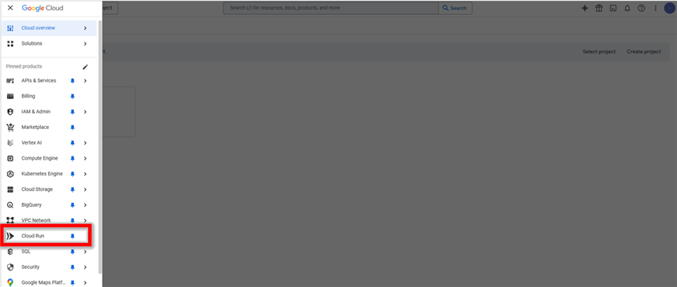
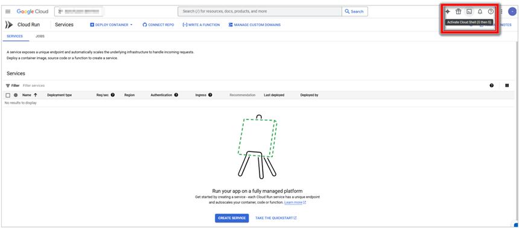
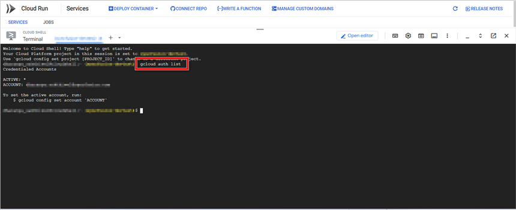
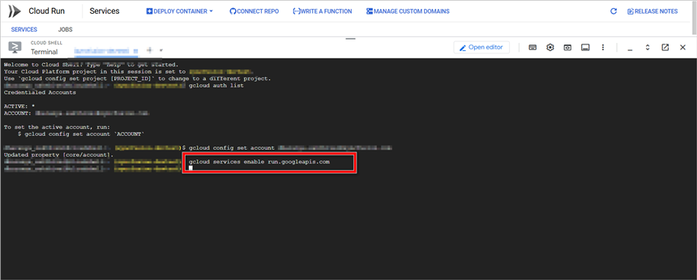
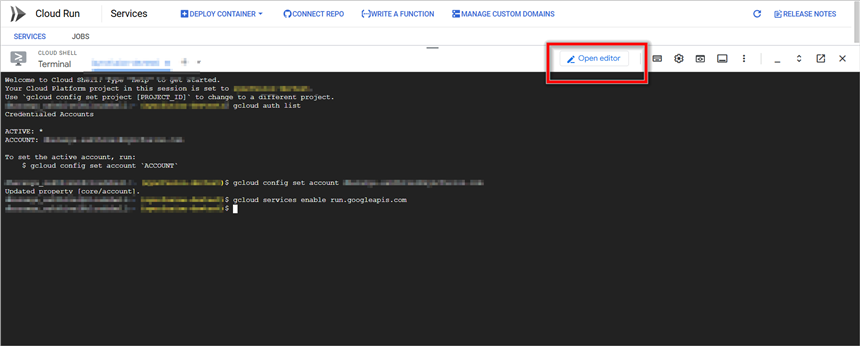
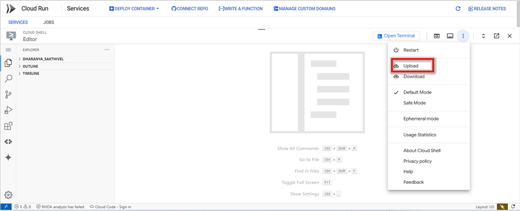
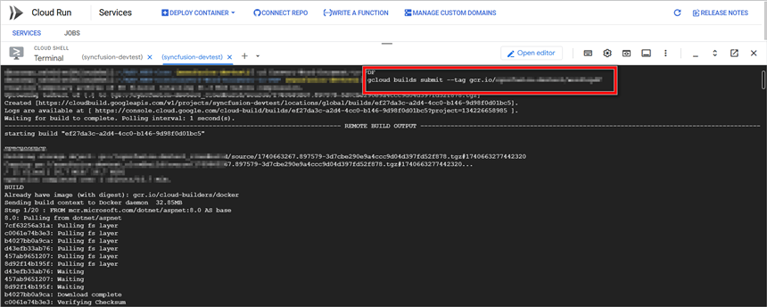
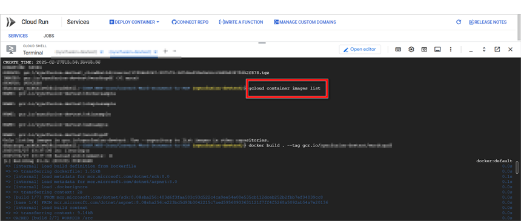
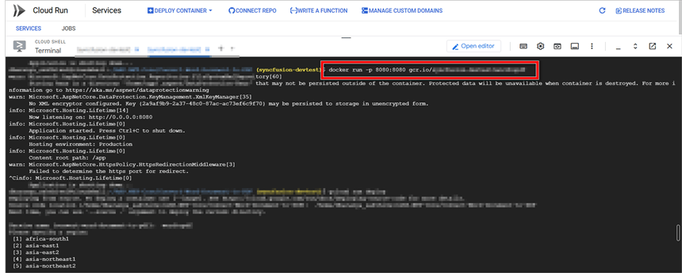
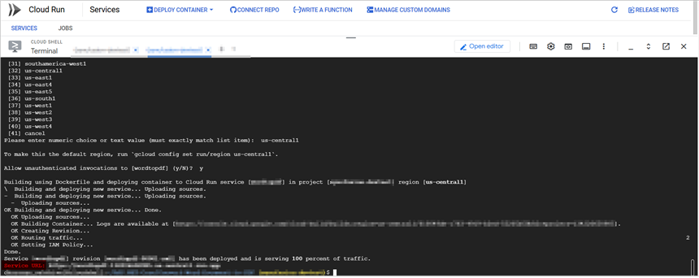

Steps to convert Word to PDF in Google Cloud Run
----------------------------------------


## Set up Cloud Run

Step 1: Access Google Cloud Console

**Sign in** to the **Google Cloud Console** and navigate to Cloud Run from the left-hand menu.




Step 2: Activate Cloud Shell

Click on the **Activate Cloud Shell** button in the top-right corner of the console. This opens a built-in terminal for running Google Cloud CLI commands without additional setup.



Step 3: Verify Authenticated Accounts

In the Cloud Shell terminal, enter the following **command** to list authenticated accounts and verify your active account:

```
gcloud auth list
```



Step 4: Set Active Account

If multiple accounts are listed, **set the desired account** as the active account using:

```
gcloud config set account <your-email@example.com>
```

Replace <your-email@example.com> with your actual Google Cloud email.

Step 5: Enable Cloud Run API

Enable the Cloud Run API using the following **command**:

```
gcloud services enable run.googleapis.com
```



This step ensures that Cloud Run is ready for deployment. If the API is already enabled, the command will confirm that no changes were needed.


## Create an application for Cloud Run

Step 1: Create a **new ASP.NET Core Web application (Model-View-Controller)** project.


Step 2: Install the below NuGet packages as a reference to your project from [NuGet.org](https://www.nuget.org/).

* [Syncfusion.DocIORenderer.Net.Core](https://www.nuget.org/packages/Syncfusion.DocIORenderer.Net.Core)
* [SkiaSharp.NativeAssets.Linux.NoDependencies](https://www.nuget.org/packages/SkiaSharp.NativeAssets.Linux.NoDependencies/)

N> Starting with v16.2.0.x, if you reference Syncfusion<sup>&reg;</sup> assemblies from trial setup or from the NuGet feed, you also have to add "Syncfusion.Licensing" assembly reference and include a license key in your projects. Please refer to this [link](https://help.syncfusion.com/common/essential-studio/licensing/overview) to know about registering Syncfusion<sup>&reg;</sup> license key in your application to use our components.

Step 3: Include the following namespaces in the HomeController.cs file.





using Syncfusion.DocIO;
using Syncfusion.DocIO.DLS;
using Syncfusion.DocIORenderer;
using Syncfusion.Pdf;





Step 4: A default action method named Index will be present in HomeController.cs. Right click on Index method and select **Go To View** where you will be directed to its associated view page **Index.cshtml**.

Step 5: Add a new button in the Index.cshtml as shown below.





@{Html.BeginForm("ConvertWordtoPDF", "Home", FormMethod.Get);
{
<div>
    <input type="submit" value="Convert Word Document to PDF" style="width:220px;height:27px" />
</div>
}
Html.EndForm();
}





Step 6: Add a new action method **ConvertWordDocumentToPdf** in HomeController.cs and include the below code snippet to **convert the Word document to Pdf** and download it.





//Open the file as Stream
using (FileStream docStream = new FileStream(Path.GetFullPath("Data/Template.docx"), FileMode.Open, FileAccess.Read))
{
    //Loads file stream into Word document
    using (WordDocument wordDocument = new WordDocument(docStream, FormatType.Docx))
    {
        //Instantiation of DocIORenderer for Word to PDF conversion
        using (DocIORenderer render = new DocIORenderer())
        {
            //Converts Word document into PDF document
            PdfDocument pdfDocument = render.ConvertToPDF(wordDocument);

            //Saves the PDF document to MemoryStream.
            MemoryStream stream = new MemoryStream();
            pdfDocument.Save(stream);
            stream.Position = 0;

            //Download PDF document in the browser.
            return File(stream, "application/pdf", "Sample.pdf");
        }
    }
}





Step 7: Add the following code in Program.cs file.





var builder = WebApplication.CreateBuilder(args);

// Add services to the container.
builder.Services.AddControllersWithViews();

var port = Environment.GetEnvironmentVariable("PORT") ?? "8080";
var url = $"http://0.0.0.0:{port}";

var app = builder.Build();

// Configure the HTTP request pipeline.
if (!app.Environment.IsDevelopment())
{
    app.UseExceptionHandler("/Home/Error");
    // The default HSTS value is 30 days. You may want to change this for production scenarios, see https://aka.ms/aspnetcore-hsts.
    app.UseHsts();
}

app.UseHttpsRedirection();
app.UseStaticFiles();

app.UseRouting();

app.UseAuthorization();

app.MapControllerRoute(
    name: "default",
    pattern: "{controller=Home}/{action=Index}/{id?}");

app.Run(url);





Step 8: Create an docker file and add the following command.

```
FROM mcr.microsoft.com/dotnet/aspnet:8.0 AS base
RUN apt-get update -y && apt-get install -y \
    fontconfig \
    libfontconfig1 \
    libfreetype6 \
    && rm -rf /var/lib/apt/lists/*

USER $APP_UID
WORKDIR /app

# This stage is used to build the service project
FROM mcr.microsoft.com/dotnet/sdk:8.0 AS build
ARG BUILD_CONFIGURATION=Release
WORKDIR /src
COPY ["Convert-Word-Document-to-PDF.csproj", "."]
RUN dotnet restore "./Convert-Word-Document-to-PDF.csproj"
COPY . .
WORKDIR "/src/."
RUN dotnet build "./Convert-Word-Document-to-PDF.csproj" -c $BUILD_CONFIGURATION -o /app/build

# This stage is used to publish the service project to be copied to the final stage
FROM build AS publish
ARG BUILD_CONFIGURATION=Release
RUN dotnet publish "./Convert-Word-Document-to-PDF.csproj" -c $BUILD_CONFIGURATION -o /app/publish /p:UseAppHost=false

# This stage is used in production or when running from VS in regular mode (Default when not using the Debug configuration)
FROM base AS final
WORKDIR /app
COPY --from=publish /app/publish .
ENTRYPOINT ["dotnet", "Convert-Word-Document-to-PDF.dll"]
```

## Upload application to Cloud Shell Editor

Step 1: Open **Cloud Shell Editor**

Open Cloud Shell Editor by clicking the pencil icon in Cloud Shell:



Step 2: **Upload** the sample folder

Upload the Docker sample folder to Cloud Shell Editor by selecting the **Upload Files** option.



Step 3: **Navigate** to the sample folder

After uploading, open the terminal in Cloud Shell Editor and move to the sample folder using:

```
cd <sample-folder-name>
```

Replace <sample-folder-name> with the actual folder name.


## Create and Deploy Docker image in Cloud Run

Step 1: Build and submit Docker image to **Google Container Registry (GCR)**

Run the following command to build and submit the Docker image to Google Container Registry (GCR):

```
gcloud builds submit --tag gcr.io/<your-project-id>/wordtopdf
```

Replace <your-project-id> with your actual Google Cloud project ID.



Step 2: List stored container images in **GCR**

Verify the stored container images using:

```
gcloud container images list
```



Step 3: **Build** the Docker image

Enter the following command to build the application.

```
docker build . --tag gcr.io/<your-project-id>/wordtopdf
```


Step 4: **Run** the sample locally

Run the container locally on port 8080:

```
docker run -p 8080:8080 gcr.io/<your-project-id>/wordtopdf
```

To close the preview page and return to the terminal then press **Ctrl+C** for which will typically stop the process.



Step 5: **Deploy** the sample to Cloud Run

Deploy the container to Cloud Run using:

```
gcloud run deploy
```


Step 6: Provide deployment details

During deployment, provide the following:

* **Container Path** – Enter **gcr.io/<your-project-id>/wordtopdf**.
* **Service Name** – Assign a name to your service.
* **Select a Region** – Choose the deployment region when prompted.


Step 7: Retrieve the generated **Service URL**

Once deployment is complete, a Cloud Run service URL will be generated. Copy this URL to access your deployed service.


